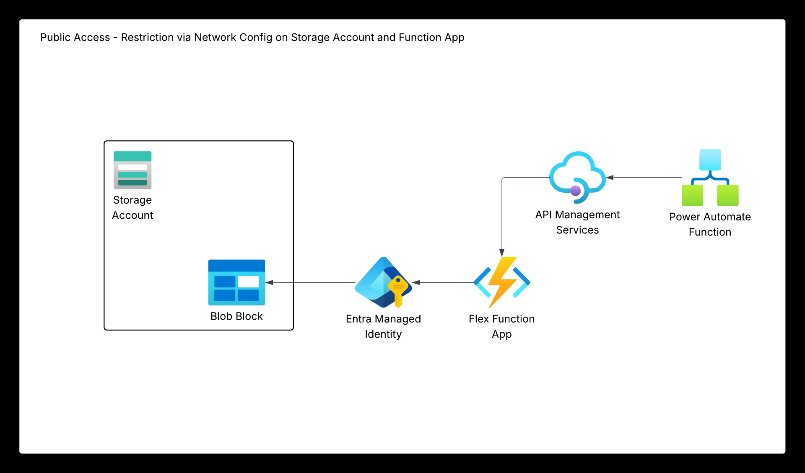
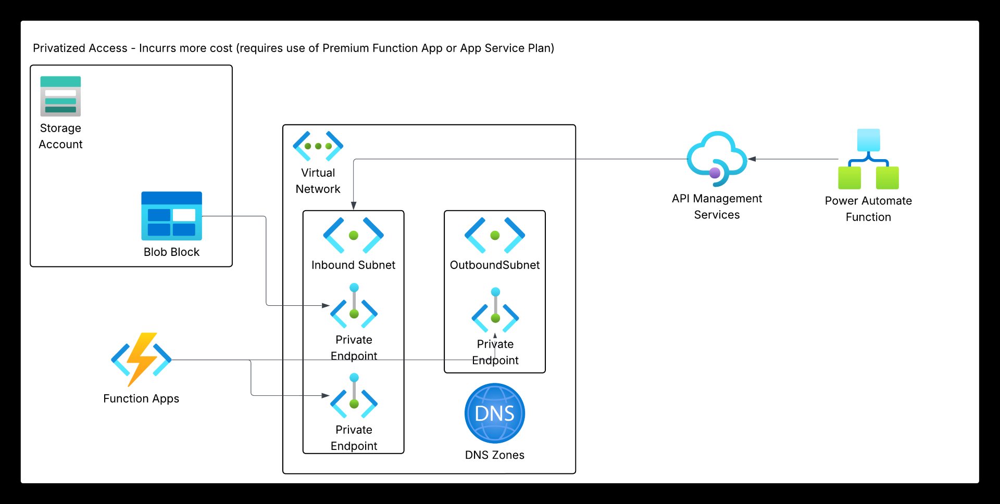

# Azure Function Apps and Storage Demo Environment

This repository demonstrates two different patterns for securing Azure Function App access to Azure Storage Accounts, plus API Management integration:

1. **Function App 1 (`sneff-fd-func-1`)**: Uses IP-based access restrictions to `stgsnefffds1`
2. **Function App 2 (`sneff-fd-func-2`)**: Uses VNet integration and private endpoint to access `stgsnefffds2`
3. **APIM Integration**: Automatically creates and configures API operations for Function App 2

## Architecture Overview

### Pattern 1: IP Restrictions


- Function App 1 → Storage Account 1 (Public endpoint with IP allowlist)
- Access controlled by function app's outbound IP addresses
- Suitable for scenarios where VNet integration is not required

### Pattern 2: Private Endpoint + VNet Integration


- Function App 2 → Storage Account 2 (Private endpoint only)
- Access via Azure Virtual Network with private DNS resolution
- Complete network isolation from public internet

### APIM Integration (New!)
- APIM API automatically created for Function App 2
- All function endpoints exposed as APIM operations
- No manual API configuration required
- See [APIM-INTEGRATION.md](APIM-INTEGRATION.md) for details

## Prerequisites

1. **Azure Subscription** with appropriate permissions
2. **GitHub Repository** with federated identity configured
3. **Terraform State Storage Account** named `snefftfdemo`
4. **GitHub Secrets** configured:
   - `AZURE_CLIENT_ID`
   - `AZURE_TENANT_ID` 
   - `AZURE_SUBSCRIPTION_ID`

## Repository Structure

```
├── terraform/
│   ├── main.tf           # Main Terraform configuration (includes APIM API setup)
│   ├── variables.tf      # Variable definitions
│   ├── outputs.tf        # Output values (includes APIM endpoints)
│   ├── locals.tf         # Local values and tagging
│   ├── backend.tf        # Terraform backend configuration
│   ├── networking.tf     # VNet, subnets, private endpoints
│   └── security.tf       # Network security rules
├── scripts/
│   ├── Test-FunctionApp1-Connectivity.ps1  # Connectivity test for Pattern 1
│   ├── Test-FunctionApp2-Connectivity.ps1  # Connectivity test for Pattern 2
│   └── Test-APIM-Integration.ps1           # Test APIM API operations (NEW)
├── .github/workflows/
│   └── terraform-deploy.yml                # CI/CD pipeline
├── APIM-INTEGRATION.md                      # APIM integration documentation (NEW)
└── README.md
```

## Deployment Instructions

### 1. Clone the Repository

```bash
git clone https://github.com/nanigan/fd-terraform-demo.git
cd fd-terraform-demo
```

### 2. Configure Backend Storage

Ensure the Terraform state storage account `snefftfdemo` exists with appropriate permissions for your federated identity.

### 3. Review Variables

Edit `terraform/variables.tf` if you need to customize:
- Resource group name
- Storage account names
- Function app names
- Network addressing

### 4. Deploy via GitHub Actions

1. Push changes to the `main` branch
2. Monitor the workflow in GitHub Actions
3. Review the Terraform plan and approve if needed

### 5. Manual Deployment (Alternative)

```powershell
cd terraform

# Initialize Terraform
terraform init

# Format and validate
terraform fmt -recursive
terraform validate

# Plan deployment
terraform plan -out=tfplan

# Apply changes
terraform apply tfplan
```

## Testing Connectivity

### Test APIM Integration (New!)

Test all Function App 2 endpoints through APIM:

```powershell
# Test all APIM endpoints
.\scripts\Test-APIM-Integration.ps1

# Test with subscription key (if enabled)
.\scripts\Test-APIM-Integration.ps1 -SubscriptionKey "your-key-here"

# Verbose output
.\scripts\Test-APIM-Integration.ps1 -Verbose
```

Or test manually:
```powershell
# Get APIM endpoints from Terraform output
terraform output apim_api_endpoints

# Test a specific endpoint
Invoke-RestMethod -Uri "https://apim-fd-public-test2.azure-api.net/funcapp2/HealthCheck"
```

### Deploy Test Functions

1. **Function App 1 Test**:
   - Deploy `scripts/Test-FunctionApp1-Connectivity.ps1` as an HTTP-triggered function
   - Access via: `https://sneff-fd-func-1.azurewebsites.net/api/test-connectivity`

2. **Function App 2 Test**:
   - Deploy `scripts/Test-FunctionApp2-Connectivity.ps1` as an HTTP-triggered function  
   - Access via: `https://sneff-fd-func-2.azurewebsites.net/api/test-connectivity`
   - **Or via APIM**: `https://apim-fd-public-test2.azure-api.net/funcapp2/...`

### Expected Test Results

#### Function App 1 (IP Restrictions)
- ✅ DNS Resolution to public IP
- ✅ HTTPS connectivity via public endpoint
- ✅ Storage access using function app's outbound IP
- ℹ️ Outbound IP addresses listed

#### Function App 2 (Private Endpoint)
- ✅ DNS Resolution to private IP (10.x.x.x)
- ✅ HTTPS connectivity via private endpoint
- ✅ VNet integration confirmed
- ✅ Storage access via private network
- ✅ Public endpoint access blocked

## Resource Details

### Created Resources

| Resource | Name | Type | Purpose |
|----------|------|------|---------|
| Resource Group | `rg-fd-demo-test` | Resource Group | Container for all resources |
| Storage Account 1 | `stgsnefffds1` | Storage Account | Public with IP restrictions |
| Storage Account 2 | `stgsnefffds2` | Storage Account | Private endpoint only |
| Function App 1 | `sneff-fd-func-1` | Function App | Tests IP-based access |
| Function App 2 | `sneff-fd-func-2` | Function App | Tests private endpoint access |
| App Service Plan | `plan-fd-demo-test-eus` | App Service Plan | S1 SKU for both functions |
| APIM Instance | `apim-fd-public-test2` | API Management | Gateway for Function App 2 |
| APIM API | `func-app-2-api` | APIM API | Auto-configured operations |
| Virtual Network | `vnet-fd-demo-test` | Virtual Network | 10.0.0.0/16 |
| Function Subnet | `snet-functions` | Subnet | 10.0.1.0/24 |
| Private Endpoint Subnet | `snet-private-endpoints` | Subnet | 10.0.2.0/24 |
| Private Endpoint | `pe-stgsnefffds2` | Private Endpoint | Storage account private access |
| Private DNS Zone | `privatelink.blob.core.windows.net` | DNS Zone | Private DNS resolution |

### Network Configuration

- **Function App 1**: No VNet integration, uses public outbound IPs
- **Function App 2**: VNet integrated with route all traffic enabled
- **Storage Account 1**: Public endpoint with IP allowlist for Function App 1 IPs
- **Storage Account 2**: Private endpoint only, no public access

## Security Features

### IP-Based Access (Pattern 1)
- Storage account denies all traffic by default
- Function app's outbound IPs are explicitly allowed
- Public endpoint remains accessible but restricted

### Private Endpoint Access (Pattern 2)
- Storage account has public access completely disabled
- Access only via private endpoint in VNet
- DNS resolution points to private IP addresses
- Function app routes all traffic through VNet

## Monitoring and Troubleshooting

### View Terraform Outputs

```powershell
terraform output
```

### Key Outputs
- Function app URLs and outbound IPs
- Storage account names and endpoints
- Private endpoint IP address
- Resource group and VNet names

### Common Issues

1. **IP Restrictions Not Working**: 
   - Check if function app IPs are correctly added to storage account
   - Verify function app has generated outbound IPs

2. **Private Endpoint Resolution Issues**:
   - Ensure private DNS zone is linked to VNet
   - Verify function app has VNet integration enabled

3. **Function Deployment Issues**:
   - Check if App Service Plan has sufficient capacity
   - Verify storage account connectivity for function runtime

### Cleanup

To remove all resources:

```powershell
terraform destroy
```

## Best Practices Demonstrated

### Terraform
- ✅ Remote state backend with OIDC authentication
- ✅ Consistent resource naming and tagging
- ✅ Modular configuration files
- ✅ Proper variable validation
- ✅ Comprehensive outputs

### Azure Security
- ✅ Managed Identity for authentication
- ✅ Network isolation patterns
- ✅ Least privilege access
- ✅ Private DNS resolution
- ✅ Secure communication channels

### DevOps
- ✅ Infrastructure as Code
- ✅ Automated CI/CD pipeline  
- ✅ Environment separation
- ✅ Plan approval workflow
- ✅ Artifact management

## Contributing

1. Create a feature branch
2. Make your changes
3. Test thoroughly
4. Submit a pull request

## License

This demo is provided for educational purposes. Modify as needed for your requirements.

## Support

For questions about this demo environment, please review the test scripts and Terraform configuration for troubleshooting guidance.